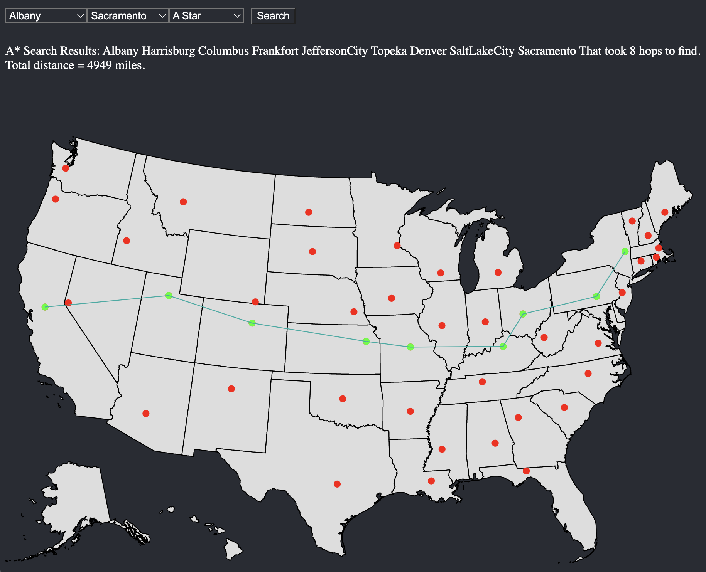

<a name="readme-top"></a>

[](https://GitHub.com/Naereen/StrapDown.js/graphs/commit-activity)
[](https://www.python.org/)


<!-- TABLE OF CONTENTS -->
<details>
  <summary>Table of Contents</summary>
  <ol>
    <li>
      <a href="#about-the-project">About The Project</a>
      <ul>
        <li><a href="#built-with">Built With</a></li>
      </ul>
    </li>
    <li>
      <a href="#getting-started">Getting Started</a>
      <ul>
        <li><a href="#prerequisites">Prerequisites</a></li>
      </ul>
    </li>
    <li><<a href="#installation">Installation</a></li>
  </ol>
</details>


<!-- ABOUT THE PROJECT -->
## About The Project




Description Here

At Runtime: 
* HERE


<p align="right">(<a href="#readme-top">back to top</a>)</p>


### Built With

Languages:
* HERE

Libraries:
* HERE

<p align="right">(<a href="#readme-top">back to top</a>)</p>


<!-- GETTING STARTED -->
## Getting Started

How To Get Started HERE

### Installation

#### WITH GUI
1. Clone the repo
  ```sh
  git clone https://github.com/dnnysoftware/GPS-Web-App.git
  ```
2. Give file execute permissions to run.sh
  ```sh
  chmod +x run.sh
  ```
3. Run Program
  * In root directory run by typing in CLI
  ```sh
  ./run.sh
  ```

#### WITHOUT GUI
1. Clone the repo
  ```sh
  git clone https://github.com/dnnysoftware/GPS-Web-App.git
  ```
2. Build the Docker Image
  ```sh
  docker build -t your-docker-username/your-project-name:your-version-number .
  ```
2. Run Docker Image
  ```sh
  docker run -it your-docker-username/your-project-name:your-version-number .
  ```

<p align="right">(<a href="#readme-top">back to top</a>)</p>